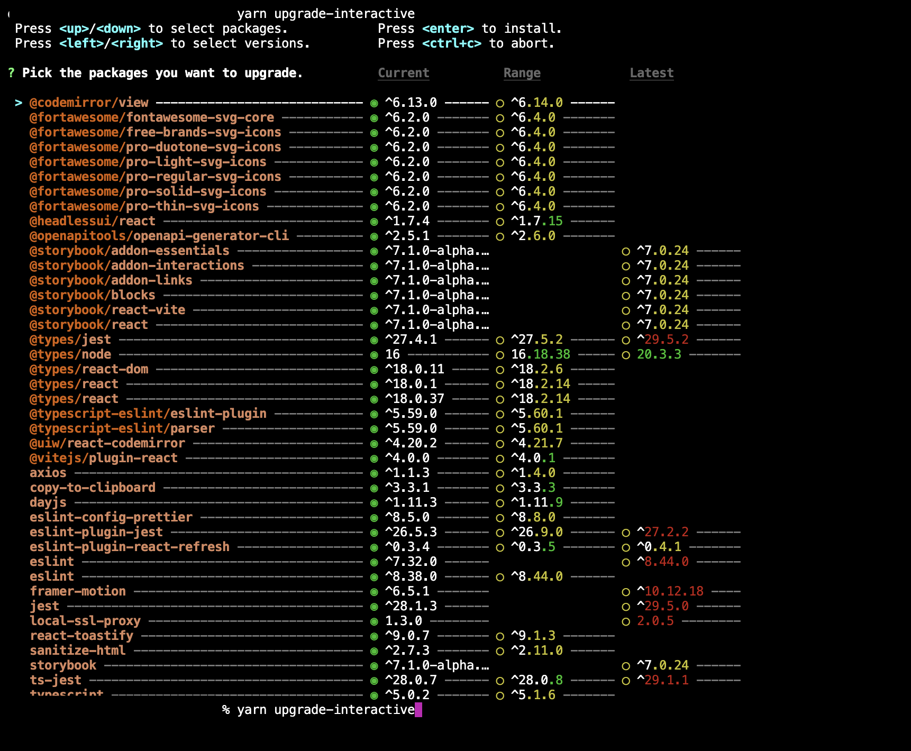

# Monorepo 2년차, yarn workspace 도입기 (최종 적용 X)


이번 변경은 시도에 그쳤습니다. 최종 변경은 다음 화를 확인해주세요!


## 생각의 과정

1. 서론
   1. 발표 계기
2. 기존에 사용해온 방식
3. 모노레포를 사용하면서 겪은 문제
   1. node\_modules 유령 의존성
   2. 프로젝트의 노쇠화 (버전 관리)&#x20;
      1. 의존성 버전 관리
      2. storybook 버전 업그레이드
4. 해결 과정
5. 결과

***

## 1. 서론

모노레포를 세팅하는 것에 대한 정보는 많이 있지만, 프로덕션 레벨에서 오랜 기간 사용 후 겪은 문제를 해결하는 내용은 많이 없었고, 다른 분들도 문제를 겪었을 때 해결하는 것을 돕기 위하여 정리를 하게 되었습니다.

***

## 2. 기존에 사용해온 방식



기존에 트윕 Frontend팀은 Turborepo를 사용해 모노레포를 구성했습니다.

병렬 실행, 쉬운 환경 설정, 빌드 캐싱에 강점이 있다고 생각해서 선택했고, 초기에는 만족을 하며 사용했습니다.


<figure><figcaption><p><a href="https://turbo.build/repo/docs/handbook/migrating-to-a-monorepo">https://turbo.build/repo/docs/handbook/migrating-to-a-monorepo</a><br></p></figcaption></figure>

`apps` directory에는 실제 트윕을 운영하기 위한 서비스를 구성했고,\
`packages` directory에는 internal package pattern을 활용하여

* apps
  * donation
  * widgets
  * ...etc
* packages
  * ui
  * shared
  * assets
  * ...etc

위와 같은 폴더 구조로 모노레포를 사용해왔습니다.

사용하면서도 이 구조에 대한 불편함은 없었고, 서비스를 개발하면서 필요한 ui나 함수를 적재적소에 사용할 수 있어서 좋았습니다.

***

## 3. 모노레포를 사용하면서 겪은 문제

그러나 초기에 모노레포를 initialize 했을 때는 괜찮았지만 시간이 지나며 여러 문제점을 발견하게 되었습니다.


### 3-1. node\_modules 유령 의존성

이미 여러 모노레포 발표들에서 node\_modules에 대한 문제점들을 많이 다뤄주셨는데요, 저희 역시 이 문제를 겪게 되었습니다.

<figure><figcaption></figcaption></figure>

가장 대표적인 예시로는 작업자가 실수로 A 서비스에서만 사용되어야할 패키지를 루트 혹은 다른 B서비스의  package.json에 명시해도 실제로는 root의 node\_modules를 참조하기 때문에 A서비스의 package.json 명단에는 없지만 import하고 사용이 가능했습니다. 이로 인해 의존성 관리가 점점 느슨해져 관리의 복잡도가 올라갔습니다.


또한, CI/CD 파이프라인에서 프로젝트를 빌드할 때 yarn install로 의존성 설치하는 시간이 굉장히 길었습니다. 의존성 설치 시간을 줄이는 사례를 찾아보며 node\_modules에 더 이상 의존하지 않아야겠다고 생각했습니다.


### 3-2. 프로젝트의 노쇠화 (버전 관리)

시간이 지남에 따라 사용하는 라이브러리의 버전이 올라가는데 여러 서비스에 여러 의존성들이 흩어져있어 관리하는데 어려움이 있었습니다.


***

## 4. 해결 과정

### 4-1. node\_modules

#### Turborepo -> Yarn workspace

node\_modules의 의존을 없애기 위해 yarn berry + pnp mode를 사용하여 이를 해결하려고 했습니다.그러나 아무리 pnp를 적용하려고 해도 정상적으로 돌아가지 않았는데 그 이유는 **Turborepo에서 pnp를 지원하지 않았기 때문**입니다.&#x20;

<figure><figcaption><p><a href="https://github.com/vercel/turbo/issues/693">https://github.com/vercel/turbo/issues/693</a></p></figcaption></figure>

해당 이슈를 확인하면 Turborepo는 pnp mode를 지원할 계획이 없다고 합니다. 여기에서 migration을 위한 첫 번째 도전이 좌절됐는데요, 방향성을 수정하고 구조를 다시 생각하며 접근했습니다. pnp mode에 대한 필요성은 꾸준히 느끼고 있었기 때문에 결국 Turborepo를 포기하고 Yarn workspace로 구성하기로 했습니다.


pnp mode를 적용하며 느낀 가장 큰 장점은 엄격하게 의존성 관리가 된다는 점입니다. 앞서 경험한 문제처럼 휴먼 에러가 발생할 수 있는 여지를 사전에 차단하고 각각의 의존성들을 압축해서 git에서 관리하기 때문에 전체적인 프로젝트의 용량도 줄어들었습니다.


#### **module can’t resolve (중요도 최상⭐️⭐️⭐️⭐️⭐️)**

<figure><figcaption><p>.yarnrc.yml</p></figcaption></figure>

외부 라이브러리를 사용할 때 해당 라이브러리에서 사용하는 dependency가 제대로 선언이 안 되어있거나 버전의 문제가 있을 경우 뜹니다. `.yarnrc.yml` yarn 설정 파일에서 다음과 같이 직접 packageExtensions 하위에 이 패키지에 다음과 같은 dependencies가 사용되고 있다고 선언해줍니다.

이렇게 작성을 해도 정상적으로 동작하는지 궁금할 수 있는데요,

<figure><figcaption></figcaption></figure>

올바르지 않는 package가 의존성 tree에 있다고 판단하면 이렇게 로그에 나오게 됩니다. 따라서 위의 `@nivo-colors`에 `d3-color` 구문은 삭제해도 됩니다.


#### 정상적으로 의존성 관리가 되면서 튀어나오는 에러 핸들링

Yarn workspace + pnp mode를 적용한 후에 의존성 관리가 정상적으로 동작함에 따라 이전의 문제들이 로그에 많이 찍히게 되었습니다. 앞서 말씀드린 유령 의존성 때문에 발생한 여러 문제들을 다시 실제로 사용되고 있는 것들만 설치를 해주었습니다.&#x20;


#### useState, useRef등 당연히 깔려있는 react hooks를 찾지 못하는 현상이 발생한다면?

1. react, react-dom이 정상적으로 깔려있는지 확인합니다.
2. @types/react @types/react-dom이 정상적으로 깔려있는지 확인합니다.
3. 되도록이면 둘 다 최신 버전을 맞춰주는 것이 좋습니다.


### 4-2. 프로젝트의 노쇠화 (버전 관리)&#x20;

#### 버전 관리&#x20;

Yarn workspace + pnp mode를 적용하며 발생한 여러 문제를 해결하고 이제 관리가 안 되어있던 버전을 가능한 최신으로 맞춰주는 작업을 했습니다.

<figure><figcaption><p>.yarnrc.yml</p></figcaption></figure>

이 때`@yarnpkg/plugin-interactive-tools` 라는 플러그인을 사용했는데요, 한 눈에 현재 프로젝트에서 사용하고 있는 의존성과 그 버전을 알 수 있고, 키보드 방향키로 버전을 선택하여 바로 업그레이드도 가능해서 너무 좋았습니다.

<figure><figcaption><p><a href="https://yarnpkg.com/api/modules/plugin_interactive_tools.html">https://yarnpkg.com/api/modules/plugin_interactive_tools.html</a></p></figcaption></figure>


#### Next.js 버전 차이로 인한 package를 불러오지 못하는 문제

<figure><figcaption><p>Module parse failed: Unexpected token</p></figcaption></figure>

pnp mode 적용하고 의존성의 버전관리를 하자 새로운 문제가 나타났습니다. 위 에러가 뜨면서 packages 하위에 있는 우리 ui나 shared를 가져오지 못하는 에러가 발생했습니다. 구체적인 내용도 없고 가져오지 못한다고만 이야기하니까 여기서 가장 많은 시간을 쏟은 것 같습니다..

**접근한 방법**

* ui에 있는 컴포넌트를 알파벳 순서대로 못 찾네?
* → 특정 ui 컴포넌트의 문제가 아니구나
* → [next-transpile-modules](https://nextjs.org/blog/next-13-1)로 패키지들 가져오는거 맞는데?
* → 아.. 업데이트 됐네
* [next-transpile-modules](https://nextjs.org/blog/next-13-1) 쓰지말고 직접 가져오라고 하는군

```javascript
const withTM = require('next-transpile-modules')([
  '@twip-fe/ui',
  '@twip-fe/shared',
]);
```


기존에는 `next-transpile-modules` 라는 외부 플러그인을 사용해서 next.config.js에 명시해줘야 사용이 가능했는데 next 13.1 버전에서 이게 업데이트 되면서 next.config.js 내부에 `transpilePackages`라는 옵션으로 쉽게 사용이 가능해졌습니다.

```javascript
transpilePackages: ["@twip-fe/ui", "@twip-fe/shared"]
```

***

## 5. 결과

**node\_modules -> pnp mode**

2.77GB(node modules) -> 471MB(.yarn)

아주 무겁던 의존성이 압축 + 중복 제거로 약 **82.93%** 감소하여 의존성 용량이 많이 줄어들었을 뿐만 아니라 더욱 견고하게 관리가 되도록 했습니다.


