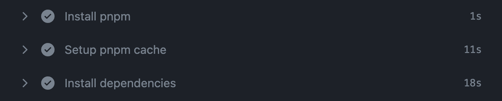

# Monorepo, 패키지 매니저를 변경하며 해결한 문제들

<figure><figcaption></figcaption></figure>

## 문제

* Turborepo + yarn berry (nodeLinker: node\_modules)로 구성된 모노레포에 의존성 설치 시간이 오래 걸렸습니다. (1m 40s)
* A workspace의 package.json에 작성되어 있는 의존성이 B workspace에서도 사용 가능한 현상이 있었습니다.
* docker build를 하기 위해 workspace를 COPY 하는 과정이 일일이 작성되어 변경에 취약했습니다.
* ci에 별도의 캐싱이 적용되어있지 않아 매번 새롭게 빌드하고 시간이 오래 걸리는 비효율적인 과정이 있었습니다.


## 이전의 시도들

사실 모노레포를 최적화하는 시도는 이번이 3번째입니다. 23년 초 트윕 대시보드 프로젝트를 초기화할 때 최적화된 모노레포와 함께 구성하고 싶어서 유령 의존성을 제거하고 ci 단계에서 install 시간을 단축시키고자 yarn pnp + docker layer caching을 적용하려고 했습니다.

그러나 **첫 번째** 시도는 실패했습니다. `nodeLinker: pnp` 를 설정하고 pnp를 사용하려고 했지만 turborepo에서 [pnp를 지원하지 않았습니다](https://github.com/vercel/turbo/issues/693).


**두 번째**는 turborepo에서 yarn pnp를 지원하지 않았기 때문에 yarn worksapce + pnp로 변경하는 시도를 했습니다. yarn workspace를 적용하고 pnp를 켰으며 이 과정에서 발생한 여러 가지 문제를 해결하여 적용은 성공했습니다. node\_modules의 의존성이 `.yarn/cache` 하위의 압축된 의존성으로 저장되고 `pnp.js`에서 이 내용을 참조할 수 있는 정보가 기록됩니다.


아쉽게도 두 번째 시도는 코드 레벨에서의 적용은 성공했지만 실서버에 적용하진 못했습니다.\
제가 두 번째 시도에 대한 글을 쓴 시점이 23년 중순이었는데 이 시기가 새로운 프로젝트 출시 전이었고, 무엇보다 모노레포 전반에 걸쳐 변경된 파일의 개수가 n만개 수준이었는데 이것이 안전한지 장담할 수 없었습니다. 이 때 **팀으로 일하는 것의 중요성**에 대해서 다시금 깨달았고, **지속 가능한 업무 방식**에 대해서 한층 더 이해한 경험이었습니다.


## 이번엔 어떻게?

이전에 시도들에서 시간이 지난 사이에 ci가 기존 jenkins에서 GitHub action으로 전환 되었고, 백엔드팀이 pnpm으로 적용한 사례를 공유했습니다.

기존의 비효율적인 프로세스를 그대로 둔다면 저 혼자라면 기껏해야 n분이겠지만 팀으로 일하는 조직에서는 **n \* 팀원 수** 만큼 시간이 늘어나게 됩니다. 이전 시도들에서 배운 교훈을 바탕으로 이번에는 다른 방향으로 접근했습니다. 이전 시도에서는 모든 변경을 한번에 진행해서 위험성이 높았다면 이번에는 **적용 범위**를 나눴습니다.

* **의존성 버전 업데이트 (Yarn)**
  * 모노레포를 초기화한지 2년 이상이 지났고 그 시간 동안 여러 의존성이 새로운 버전을 출시했기에 버전을 맞출 필요가 있었습니다.
* **yarn -> pnpm으로 패키지 매니저 변경**
  * yarn pnp를 적용하여 zero-install를 활용하면 ci 단계에서 설치 시간을 비약적으로 줄일 수 있지만 저희 팀이 처한 문제를 풀기에는 앞선 이유들로 인해 적합하지 않았습니다.
  * 따라서 pnpm을 도입하여 본질적으로 유령 의존성 문제를 해결하고 설치 시간을 줄일 수 있겠다고 생각했습니다.
* **ci 단계별 캐싱**
  * 기존에는 따로 캐싱 되어있는 단계가 없었는데 pnpm으로 유령 의존성 문제가 해결되고 docker base image를 생성한다던지, pnpm install caching을 적용한다던지 등등 여러 방법들이 있었습니다.


## 1. 의존성 버전 업데이트 (Yarn)

의존성 버전 업데이트는 `@yarnpkg/plugin-interactive-tools` 플러그인을 적용해서 일괄로 하면 금방하겠다고 생각했지만 일괄로 업데이트 했더니 생각보다 범위가 컸고, 전에 했던 실수를 그대로 할 뻔 했습니다.

그래서 영향력이 큰 main 의존성 (Node, typescript, next), 영향력이 작은 sub 의존성들로 범위를 나누어 진행했습니다.

Node 버전을 기존 16에서 20으로 업데이트 했는데 storybook에서 에러가 발생했습니다. ([Storybook Node error](https://github.com/storybookjs/storybook/issues/19692)) storybook도 함께 버전업을 진행하면 됐고, 이건 팀원분께서 도와주셔서 다행히 빠르게 대응이 되었습니다.


## 2. yarn → pnpm으로 패키지 매니저 변경

pnpm은 [**symbolic link**](https://pnpm.io/symlinked-node-modules-structure)를 사용해 의존성의 중첩된 구조를 연결합니다. 만약 의존성 B가 의존성 A에 의존하다면, Node는 B하위에 명시된 symlinked된 `A/node_modules/B`를 바로 사용하지 않고 symlink가 가리키는 진짜 위치인 `A/node_modules/A`를 참조합니다.

따라서 공식 문서에서 언급된 바와 같이 **hoisting 되어 flattern한 node\_modules에서 발생했던 유령 의존성 문제를 해결**할 수 있기 때문에 저희 팀에 맞는 방향이라 생각하여 적용했습니다.

> A great bonus of this layout is that only packages that are **really in the dependencies are accessible.** With a flattened node\_modules structure, all hoisted packages are accessible.


적용은 그리 어렵지 않았습니다. 기존 repository에 있는 **yarn 관련된 파일과 코드를 삭제하고 pnpm으로 대체**했습니다. 부끄럽지만 기존에 A workspace에 설치된 의존성이 hoisting되어 B에서도 사용 가능한 문제가 pnpm을 적용하자 드러났고 사용은 되지만 설치 되지 않은 의존성들을 모두 설치해주었습니다.

이 때 매번 설치하고 빌드 되는지 확인하고를 반복하다가 vscode에서 파일이 열려있지 않아도[ TS 에러를 일괄로 보여주는거 없나?](https://stackoverflow.com/questions/55201424/how-to-get-vscode-to-show-typescript-errors-for-files-not-open-in-the-editor) 하고 궁금증이 생겨 검색해보니 다행히 있었습니다.

`"typescript.tsserver.experimental.enableProjectDiagnostics": true` 를 설정해주었고, 에러가 있는 부분을 일괄로 확인할 수 있었습니다.


## 3. ci 단계별 캐싱

### 3-1. 문제 확인

서비스 특성상 2가지의 GitHub action이 존재했습니다.

* PR에서 build가 성공하는지 확인하는 build 결과 확인용 GitHub action
* 실제 ci/cd 파이프라인을 타는 배포용 GitHub action


pnpm을 최종 배포하기 전까지는 pnpm 코드가 파이프라인을 타면 안 됐고 여기선 GitHub action workflow에서 의존성을 설치하고 빌드하기 때문에 build 결과 확인용 GitHub action에 먼저 pnpm을 적용했습니다.

action에서 install 시간이 줄어든 것을 확인하고 나머지 ci/cd 파이프라인도 별도의 dockerfile과 workflow를 구성하여 기존 시스템에는 영향이 없도록 테스트 환경에서 적용했습니다.


이 때 확인한 내용은 다음과 같습니다.

* build 결과 확인용 action
  * pnpm install caching + 의존성 설치 시간 단축
  * turborepo remote caching
* ci/cd
  * action
    * docker layer caching
  * docker
    * turborepo prune 활용
    * 의존성 설치 시간 단축


### 3-2. 해결 과정

**pnpm install caching**

먼저 pnpm install caching입니다. pnpm/action-setup 플러그인 repository에 친절하게 사용법이 나와있습니다.

```yaml
  - uses: actions/cache@v3
	name: Setup pnpm cache
	with:
	  path: ${{ env.STORE_PATH }}
	  key: ${{ runner.os }}-pnpm-store-${{ hashFiles('**/pnpm-lock.yaml') }}
	  restore-keys: |
		${{ runner.os }}-pnpm-store-
```

> 가장 핵심이 되는 내용인데요, 결국 GitHub [action/cache](https://github.com/actions/cache)를 활용하여 pnpm-lock.yaml 파일이 변경되지 않았다면 (cache hitted!) 캐싱된 node\_modules를 사용하고 캐싱된 값이 없다면 의존성을 새로 설치합니다.

이는 pnpm 뿐만 아니라 다른 패키지 매니저를 사용해도 action/cache 플러그인을 활용하여 동일하게 (npm이라면 package-lock.json를 hash) 사용 가능한 것으로 이해하고 있습니다.

<figure><figcaption></figcaption></figure>

<figure><figcaption></figcaption></figure>


**Turborepo remote caching**

[turbo](https://turbo.build/repo/docs/core-concepts/caching)는 기본적으로 매 빌드 시 캐싱 파일을 먼저 확인합니다.\
build할 때는 input → build → output을 거치기 때문에 inputs, outputs 각각 파일이 있습니다.

1. turbo는 기본적으로 input 파일들을 계산하고 이를 hash로 변환합니다.
2. local filesystem cache를 확인하고 inputs hash와 매칭되는 것이 있는지 확인합니다.
   1. `node_modules/.cache/turbo/hash어쩌구.tar.zst`
3. 만약 turbo가 계산된 해쉬 artifact를 찾지 못하면 build를 수행합니다.
   1. 
4. build가 성공하면 turbo는 outputs를 새로운 cache artifact로 저장하고 hash된 주소로 저장합니다.
   1. 
5. 별다른 변경사항이 없다면 inputs hash가 동일할겁니다.
6. turbo가 동일한 hash를 가진 값이 있는지 local filesystem을 확인합니다.
7. build를 수행하는 대신 해당 outputs를 replay합니다.
   1. .png>)

> 로컬에서 개발할 때는 같은 내용을 캐싱하는 이점을 활용할 수 있지만, ci 단계에서 다른 머신으로 빌드할 때는 추가적인 조치가 필요합니다. 별도의 self hosted 머신을 사용한다면 모르겠지만, ci가 실행될 때마다 다른 머신에서 돌게 되고 캐싱된 값을 local file system에 저장하는 turbo는 매번 새로운 빌드를 수행하게 될 것 입니다.

그래서 remote 환경에서 turbo 캐싱의 이점을 살리려면 추가적인 조치가 필요합니다. [turbo remote caching](https://turbo.build/repo/docs/core-concepts/remote-caching) 기능을 활용하는 방법이 있습니다. 저희는 GitHub action/cache를 활용해서 GitHub 저장소에 저장하는 방법을 선택했습니다. 다음은 [공식문서](https://turbo.build/repo/docs/ci/github-actions)에 나와있는 핵심 코드입니다.

```yaml
- name: Cache turbo build setup
- uses: actions/cache@v3
- with:
	path: .turbo key: ${{ runner.os }}-turbo-${{ github.sha }}
	restore-keys: |
		${{ runner.os }}-turbo-
```

앞선 pnpm install caching에서 본 것과 원리는 동일합니다.

```json
"build": "turbo run build --cache-dir=.turbo"
```

turbo build 할 때 cache directory를 root로 빼주었습니다. 기본 값은 `./node_modules/.cache/turbo` 인데 node\_modules는 머신마다 새롭게 설치해야하기 때문에 `.turbo` 를 루트에 두고 build 스탭 전에 이전에 캐싱된 output file을 확인하라고 권장합니다.

> Configure your github pipeline with a step which utilizes the actions/cache@v3 action before the build steps of your ci file.

<figure><figcaption></figcaption></figure>

<figure><figcaption><p><strong>13m 33s</strong>(cold start) -> <strong>4m 21s</strong>(1 workspace run) -> <strong>1m 51s</strong>(FULL_TURBO)</p></figcaption></figure>

#### 3-2-2. ci/cd

**turbo build, docker에 최적화**

기존에는 monorepo의 A 서비스를 빌드하기 위해서 dockerfile에서 직접 A서비스를 빌드하는데 필요한 의존성이나 소스코드를 COPY 했었습니다. 하지만 이럴 경우에 구조를 바꾸고 싶은 경우 dockerfile이 hard coding 되어있어 의존성이 하나 생기고 turborepo의 이점을 사용하지 못한다는 단점이 있었습니다.

이런 문제를 해결하기 위해 **turbo cli의 prune** 기능을 활용했습니다. 구성한 dockerfile을 stage별로 설명 드리겠습니다.

1. ```docker
   FROM node:20-alpine AS alpine
   ```
   1. alpine 스테이지입니다.
   2. node:20-alpine으로 환경을 세팅합니다.
2. ```docker
    FROM alpine as base
    RUN apk add --no-cache libc6-compat
    RUN apk update
    ENV PNPM_HOME="/pnpm"
    ENV PATH="$PNPM_HOME:$PATH"
    RUN corepack enable
    RUN pnpm install turbo --global
   ```
   1. base 스테이지입니다.
   2. alpine으로부터 환경을 가져오고 base를 선언합니다.
   3. libc6-compat 라이브러리를 설치하는 이유?
      1. [libc6-compat node issue](https://github.com/nodejs/docker-node/tree/b4117f9333da4138b03a546ec926ef50a31506c3#nodealpine)
      2. process.dlopen 을 사용하는 공유 라이브러리가 누락될 수 있는 이슈가 있어서 해당 라이브러리를 설치하여 예방합니다.
   4. [pnpm docker](https://pnpm.io/docker)
      1. PNPM\_HOME: home directory를 env로 선언하여 pnpm 패키지 매니저가 설치될 경로를 지정합니다.
      2. PATH: /pnpm 디렉토리로부터 실행 파일을 찾아 pnpm 명령을 실행 가능하게 합니다.
      3. corepack enable: pnpm을 설치하는 다양한 방법이 있지만 그 중 하나가 [corepack](https://pnpm.io/installation#using-corepack)을 이용하는 방법입니다.
         1. corepack은 node.js의 패키지 매니저의 버전을 관리하는 도구입니다.
      4. 전역으로 twip-next-fe의 모노레포 관리툴인 turbo를 설치합니다.
3. ```docker
   FROM base AS builder
   WORKDIR /app
   COPY . .
   RUN turbo prune --scope=@foo --docker
   ```
   1. builder 스테이지입니다.
   2. Docker 내에서 작업 디렉토리를 /app으로 설정합니다.
   3. 모든 파일을 /app 으로 복사합니다.
   4. [turbo prune](https://turbo.build/repo/docs/reference/command-line-reference/prune)
      1. monorepo 안에서 scope로 지정된 workspace에서 빌드시 필요한 소스코드만 가져옵니다.
      2. 따라서 이전처럼 특정 서비스의 directory를 일일히 복사할 필요가 없습니다.
      3. root의 lockfile에서 prune된 workspace에 사용되는 의존성들만 있는 새로운 lockfile이 생성됩니다.&#x20;
         1. 이 서비스에선 `pnpm-lock.yaml`
   5. \--docker option
      1. docker layer caching을 사용하기 쉽도록 output folder가 pruned workspace로 변경됩니다.
      2. json, full 폴더가 생기게 되는데요,
         1. json: pruned workspace에서 필요한 package.json들이 있습니다.
         2. full: pruned workspace에서 빌드시 필요한 소스코드들이 있습니다.
4. ```docker
   FROM base AS installer
   WORKDIR /app

   # 환경변수

   COPY .gitignore .gitignore
   COPY --from=builder /app/out/json/ .
   COPY --from=builder /app/out/pnpm-lock.yaml ./pnpm-lock.yaml
   COPY --from=builder /app/out/pnpm-workspace.yaml ./pnpm-workspace.yaml
   RUN pnpm install --frozen-lockfile

   ARG NODE_ENV=production
   COPY --from=builder /app/out/full/ .
   COPY turbo.json turbo.json
   RUN pnpm build:foo
   ```
   1. installer 스테이지입니다.
   2. 작업 디렉토리를 /app 으로 선언하고 필요한 환경변수를 선언합니다.
   3. install layer
      1. builder 스테이지로부터 패키지 install시 필요한 파일들을 복사합니다.
      2. pnpm install을 하면 package.json에 맞게 lockfile(pnpm-lock.yaml)이 변경되는데 이를 변경하지 않도록 --frozen-lockfile을 선언하여 pnpm-lock.yaml이 변경되지 않도록 합니다.
         1. (개발했을 때의 환경과 달라지면 의도치 않은 의존성 변경이 발생할 수 있음)
   4. build layer
      1. NODE\_ENV=production을 install 설치 전에 선언하게 되면 devDependencies를 설치하지 않게 되고 build시 필요한 typescript를 불러오지 못하기 때문에 install 이후에 production build를 하도록 build전에 선언합니다.
      2. build시 필요한 파일들을 복사합니다.
      3. pnpm build:foo로 빌드를 진행합니다.
5. ```docker
    FROM alpine AS runner
    WORKDIR /app
    
    RUN addgroup --system --gid 1001 nodejs
    RUN adduser --system --uid 1001 nextjs
    USER nextjs
    
    COPY --from=installer /app/apps/foo/next.config.js .
    COPY --from=installer /app/apps/foo/package.json .
    
    COPY --from=installer --chown=nextjs:nodejs /app/apps/foo/.next/standalone ./
    COPY --from=installer --chown=nextjs:nodejs /app/apps/foo/.next/static ./apps/foo/.next/static
    COPY --from=installer --chown=nextjs:nodejs /app/apps/foo/public ./apps/foo/public
    
    EXPOSE 3000
    ENV PORT 3000
    
    CMD ["node", "apps/foo/server.js"]
   ```
   1. runner 스테이지입니다.
   2. addgroup: nodejs라는 system 그룹을 설정하고 group id를 1001로 설정합니다.
   3. adduser: nextjs라는 system 사용자를 설정하고 user id를 1001로 설정합니다.
   4. USER nextjs: 이후 명령들이 nextjs 사용자로 실행되도록 설정합니다.
      1. 이후 실행되는 명령들은 이 USER의 권한에 따라 실행됩니다.
   5. installer 스테이지에서 빌드했던 결과물에서 next 서버 실행시 필요한 내용을 복사합니다.
   6. PORT를 3000으로 설정하고 server.js를 실행하여 next를 실행합니다.
   7. 정상적으로 실행된 것을 볼 수 있습니다\~!
      1. .png>)


**Action Docker layer caching**

배포를 위한 빌드에 docker image build를 사용한다면 GitHub action에서 설정할 수 있는 방법이 있습니다. [docker/build-push-action](https://docs.docker.com/build/cache/backends/gha/#using-dockerbuild-push-action) 플러그인을 이용하는 방법입니다.

```yaml
cache-from: type=gha
cache-to: type=gha,mode=max
```

이 플러그인은 BuildKit이라는 툴킷의 buildx 명령을 활용합니다. BuildKit에서 [GitHub action에서 캐싱](https://github.com/moby/buildkit?tab=readme-ov-file#github-actions-cache-experimental)을 걸 수 있는 방법이 나와있지만[ 아직 실험적인 기능](https://docs.docker.com/build/ci/github-actions/cache/#github-cache)이라고 합니다. (22년도에도 실험적이라고 했는데 언제까지.. ㅠ)

> 앞선 pnpm과 turbo가 하나의 artifact가 나오는 반면 docker는 layer 별 캐싱을 해서인지 여러개의 artifact가 생기고 사이즈도 모두 다릅니다. (이 방법이 최선일지에 대해서는 고민을 더 해봐야할 것 같습니다.)

<figure><figcaption></figcaption></figure>

실제 build 결과를 보면 layer별로 캐싱된 부분은 CACHED라고 표시되며 적용된 것을 확인할 수 있습니다.

<figure><figcaption></figcaption></figure>

<figure><figcaption><p>6m 22s -> 1m 11s (Full Cached)</p></figcaption></figure>


## 결과

* **build 결과 확인용 action**
  * pnpm install caching + 의존성 설치 시간 단축
    * 캐싱 된 artifact가 있을 경우
      * install: **1s**
      * pnpm cache setup: **11s**
      * install dependencies: **18s**
    * **1m 40s → 30s (70% 감소)**
  * turborepo remote caching
    * 이 build-repo는 기본적으로 모든 workspace를 빌드합니다.
    * cold start: **13m 33s**
    * 1 workspace build: **4m 21s (68% 감소)**
    * FULL\_TURBO: **1m 51s (87% 감소)**
* **ci/cd**
  * action
    * docker layer caching
    * 1 workspace build: **6m 22s → 1m 11s (81% 감소)**
  * docker
    * turborepo prune 활용
    * 의존성 설치 시간 단축
      * **1m 40s → 40s (60% 감소)**


따라서 정리해보면 다음과 같습니다.

* build 결과 확인용 action
  * 의존성 설치시간이 **70%** 감소했습니다.
  * workspace 1개만 빌드할 경우 **68%**, FULL\_TURBO일 경우 최대 **87%** 감소했습니다.
* ci/cd
  * 의존성 설치시간이 **60%** 감소했습니다.
  * docker layer caching이 적용되어 **60%** 감소했습니다.


## 마무리

23년에 했던 경험을 바탕으로 기존 모노레포의 비효율을 개선하기 위해 패키지 매니저를 변경하고 ci에 캐싱을 적용하여 최적화를 진행했습니다. 그 결과 눈에 띄는 개선점이 있었고, 이 과정에서 monorepo 생태계, dockerize, GitHub action ci 등 여러 방면에 걸쳐 지식이 한층 늘어난 것 같습니다.

개선 결과는 모노레포의 구성과 환경에 따라 달라질 수 있으며 `이걸 적용하면 반드시 이 정도의 개선이 있다`를 의미하지 않습니다.&#x20;

마음 한편에 남아있던 문제를 해결할 수 있어서 좋았습니다. 감사합니다!


## Reference

* turbo pnp issue
  * [https://github.com/vercel/turbo/issues/693](https://github.com/vercel/turbo/issues/693)
* storybook node error
  * [https://github.com/storybookjs/storybook/issues/19692](https://github.com/storybookjs/storybook/issues/19692)
* pnpm
  * [https://pnpm.io/symlinked-node-modules-structure](https://pnpm.io/symlinked-node-modules-structure)
* vscode ts error
  * [https://stackoverflow.com/questions/55201424/how-to-get-vscode-to-show-typescript-errors-for-files-not-open-in-the-editor](https://stackoverflow.com/questions/55201424/how-to-get-vscode-to-show-typescript-errors-for-files-not-open-in-the-editor)
* GitHub action cache
  * [https://github.com/actions/cache](https://github.com/actions/cache)
* turbo
  * [https://turbo.build/repo/docs/core-concepts/caching](https://turbo.build/repo/docs/core-concepts/caching)
  * [https://turbo.build/repo/docs/core-concepts/remote-caching](https://turbo.build/repo/docs/core-concepts/remote-caching)
  * [https://turbo.build/repo/docs/ci/github-actions](https://turbo.build/repo/docs/ci/github-actions)
* docker
  * [https://github.com/nodejs/docker-node/tree/b4117f9333da4138b03a546ec926ef50a31506c3#nodealpine](https://github.com/nodejs/docker-node/tree/b4117f9333da4138b03a546ec926ef50a31506c3#nodealpine)
  * [https://github.com/moby/buildkit?tab=readme-ov-file#github-actions-cache-experimental](https://github.com/moby/buildkit?tab=readme-ov-file#github-actions-cache-experimental)
  * [https://docs.docker.com/build/ci/github-actions/cache/#github-cache](https://docs.docker.com/build/ci/github-actions/cache/#github-cache)
  * turbo pnpm + docker
    * [https://github.com/vercel/turbo/issues/5462#issuecomment-1712229432](https://github.com/vercel/turbo/issues/5462#issuecomment-1712229432)
