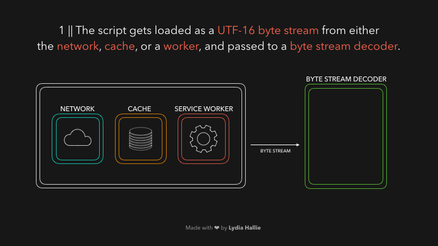
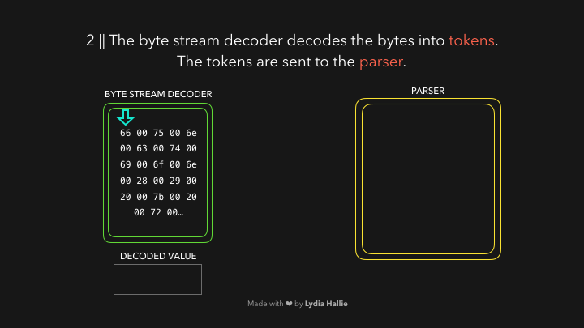
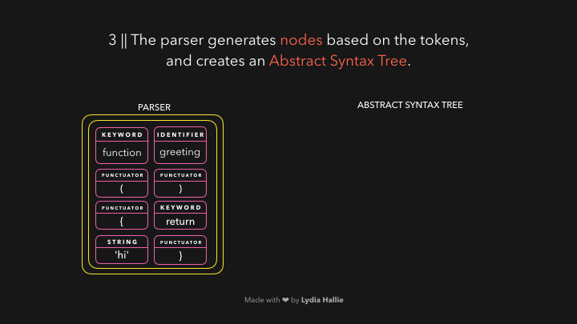
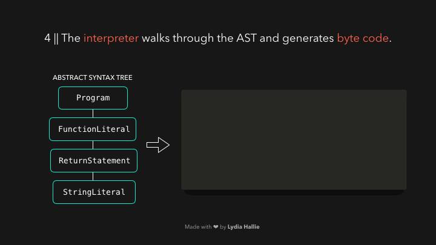
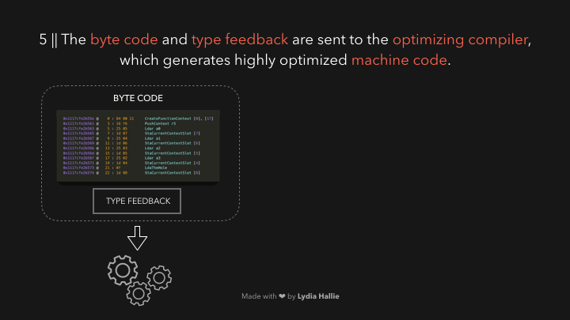

# \[Javascript] Language, Engine, Timing에 대하여

## 1. Program

### Interpreter란?

* Interpreter란 해설가 혹은 통역사라는 의미로
* high-level programming language로 작성된 프로그램을 직접 실행하거나 intermediate language로 변경하여 실행할 수 있는 프로그램입니다.
* Interpreter가 코드의 상태를 각각 읽고 변경하거나 직접 실행합니다.

<figure><figcaption>
<a href="https://inprogrammer.com/high-level-vs-low-level/">source</a>
</figcaption></figure>

### Compiler란?

* Compiler도 마찬가지로 해석기, 번역기라는 뜻입니다.
* Assembler 혹은 Compiler가 high-level source code를 native code로 변경합니다.
* `.exe` 파일처럼 실행이 가능하도록 하기 위함입니다.

***

## 2. Javascript V8 Engine

### Javascript V8 엔진 동작 원리

<figure><figcaption></figcaption></figure>

1. 기본적으로 Javascript는 HTML parser가 script 태그를 마주치면 코드는 network, cache, service worker로부터 **로드를 시도**합니다.
   * response에 요청했던 스크립트를 Byte stream으로 받습니다.
   * 이 때 Byte stream decoder가 디코딩합니다.

<figure><figcaption></figcaption></figure>

2. Byte stream decoder가 디코딩된 byte stream로 부터 **token을 생성**합니다. (Tokenizing)
   * 여기서 생성된 토큰은 Parser로 보내집니다. (Parsing)
   * 이 때 Parser와 pre-parser 2가지가 있는데
   * pre-parser는 나중에 사용할 수 있는 코드를 처리하고 (button click event)
   * Parser는 즉시 필요한 코드를 처리합니다.

<figure><figcaption></figcaption></figure>

3. Parser는 token을 기반으로 node를 생성하고 이를 사용하여 **AST(추상 구문 트리)가 생성**됩니다.

<figure><figcaption></figcaption></figure>

4. **Interpreter**가 AST를 읽고 byte code로 변환합니다.
   * 변환이 모두 끝나면 메모리 공간을 정리하기 위해 AST는 삭제 됩니다.
   * Byte code는 빠르지만, 더 빠르게 동작할 수 있습니다.

<figure><figcaption></figcaption></figure>

5. **Profiler**가 자주 사용된 코드와 데이터 유형을 관찰하여 type feedback을 생성하고 Optimizing compiler(최적화 컴파일러)로 전송합니다.
   * Optimizing compiler가 가장 최적화된 코드로 이를 **Compile**합니다.
   * 실제 실행하는 시점에 동적으로 machine code로 변경하는 기법을 [JIT Compile](https://ko.wikipedia.org/wiki/JIT\_%EC%BB%B4%ED%8C%8C%EC%9D%BC)이라고 합니다.
   * 이 JIT 코드는 Interpreted language에 비해 훨씬 좋은 성능을 냅니다.

### Javascript는 Interpreted or Compiled?

* Interpreter와 Compiler는 각각의 장단점이 있으며 상호 보완적으로 사용이 가능합니다.
  * 이는 곧 javascript 같은 몇몇의 high-level language에서 compilation, translation 두 가지 모두 사용할 수 있다는 것을 의미합니다.
* Javascript는 기본적으로 Interpreted Language 입니다.
  * 브라우저 콘솔창에서 이를 증명할 수 있습니다.
* 초기에는 브라우저의 요구사항이 많은 리소스를 필요하지 않아서 Interpreter로 충분했지만
* 지도처럼 고성능 프로세싱 파워가 필요한 경우를 대응하기 위해서
* google에서는 V8 Javascript engine을 만들었고
* 최적화 컴파일러에 의해서 Compiler도 필요해졌습니다.

**따라서 Javascript는 Interpreted language이지만, 최적화를 위해 Compiler 특성 또한 갖고 있다고 할 수 있습니다.**

***

## 3. Timing

<figure><figcaption>
Compile &#x26; Runtime (<a href="https://medium.jonasbandi.net/angular-vs-react-compilers-45b279a8f571">source</a>)
</figcaption></figure>

### Buildtime

* Bundling
  * Javascript 프로젝트에서 분할 되어있는 여러 파일들을 하나의 큰 파일로 번들링합니다.
  * **모듈 번들러**라고 불리는 Webpack, rollup 등이 이 역할을 수행합니다.
* Transpiling
  * 브라우저 간의 호환성 문제로 최신(ES6+) 문법을 구 버전의 문법(ES5)으로 변환하는 Transpiling 프로세스가 수행됩니다.
  * 주로 Babel이 사용되어왔지만 최근 제가 사용하는 Next.js에서는 SWC로 이를 대체하여 더욱 강력한 성능을 보여줍니다.
* Minifying
* CodeSplitting

### Runtime

* Runtime은 build & deploy된 이후 프로그램이 실행되는 기간입니다.
  * ex) server에 request하고 response를 받는 경우

***

## 참고 & 출처

* Interpreter, Compiler
  * [https://www.techopedia.com/definition/7793/interpreter](https://www.techopedia.com/definition/7793/interpreter)
  * [https://web.stanford.edu/class/cs98si/slides/overview.html](https://web.stanford.edu/class/cs98si/slides/overview.html)
* Javascript V8 Engine 정보 및 이미지 출처
  * [https://dev.to/lydiahallie/javascript-visualized-the-javascript-engine-4cdf](https://dev.to/lydiahallie/javascript-visualized-the-javascript-engine-4cdf)
  * [https://medium.com/@vinodkotagiri/chrome-v8-engine-be571c286d3f](https://medium.com/@vinodkotagiri/chrome-v8-engine-be571c286d3f)
* Timing
  * [https://dev.to/jenc/build-time-runtime-execution-time-what-time-is-it-in-javascript-42ea](https://dev.to/jenc/build-time-runtime-execution-time-what-time-is-it-in-javascript-42ea)
  * [https://nextjs.org/learn/foundations/how-nextjs-works/buildtime-and-runtime](https://nextjs.org/learn/foundations/how-nextjs-works/buildtime-and-runtime)
