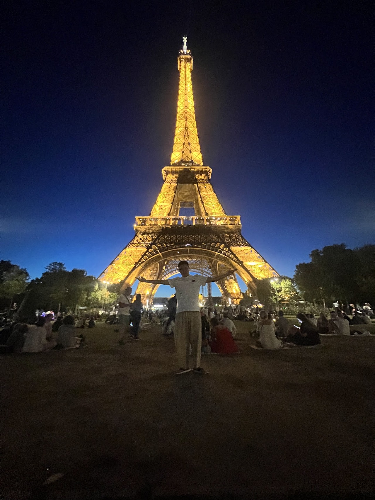

# Frontend 개발자 1년 회고록

안녕하세요. EJN에서 트윕 Frontend 개발을 하고있는 대니입니다.

이번 달에 제가 일한지 벌써 1년이 되어서 그동안의 회사 안팎에서 뭐하고 지냈는지 돌아보려 합니다.

### 입사 초기 (1 \~ 4개월)

#### 회사

첫 입사 이후 1개월 현장실습, 3개월은 수습기간이었습니다.

제가 회사에서 유일한 주니어였기 때문에 주로 배우는 입장이었습니다.

이 때 제 시니어분이 내주신 백오피스 구현 과제를 했습니다.

\

회사 분위기도 좋고 자유로운게 가장 마음에 들었습니다.

매 순간이 새로운 경험이었기 때문에 회사와 서울에 적응하고 배우며 시간을 보냈습니다.

\

4개월차에 본격적으로 Frontend 업무를 배정받아 개발을 하게 되었습니다.

이 프로젝트가 UI 컴포넌트 디자인 시스템 - 페이지 컴포넌트, 레이아웃 - 데이터 패칭 ...etc

Frontend 일련의 과정을 경험 많은 시니어 분의 서포팅과 함께 경험할 수 있어

주니어인 저로써는 발전할 수 있는 최고의 환경이 마련되어 굉장히 좋았습니다.

\

12월에 제 생일도 챙겨주시고

12월 말에 EJN 연말파티도 재밌는 경험이었습니다.

\

**Main**

* 첫 회사는 EJN 👍🏻\

#### 나

서울도 알아갈 겸 여기저기 많이 돌아다녔습니다.

시간 날 때 자기 개발도 하고 집에 필요한 것들이나 내가 사고 싶었던 것들을 사며 돈을 썼습니다.

<figure><figcaption></figcaption></figure>

12월은 서울에서 첫 생일을 맞았고 1월에 새로운 해를 맞이함과 동시에 고등학교를 졸업하며

성인이 되었으니 목표대로 더 열심히 인생을 살겠다고 다짐했습니다.

\

\

**Main**

* Hustle 해보자!!
* 졸업

***

### 중반 (5 \~ 10개월)

#### 회사

\

꾸준하게 성장하고 배우는중 🏃🏻‍♂️

\

스프린트를 진행하며 작업을 배정받고 일정에 따라 개발을 하고 코드 리뷰를 받으며 꾸준히 성장하는 시기입니다.

저 스스로 모르는 것을 리서치하고 개발하면서 성장하는 것도 있지만

시니어분의 피드백과 코드리뷰를 받을 때 가장 많이 성장하는 것 같습니다.

\

제가 해결하지 못한 오류를 바로 알아내시고

가르쳐 주시는게 정말 신기했습니다. (이것이.. 시니어..?)

개발에서 배운 것도 있지만 무엇보다도 같이 일하고 싶은 개발자가 어떤건지 알게되었습니다.

\

회사 내에서의 개발은 혼자 잘하는 것 보다

팀 혹은 조직이 함께 발전할 수 있는 방향의 개발을 하는 것이

회사, 팀, 개인 모두에게 이익입니다.

\

이기적인 팀원 때문에 자칫 잘못하다가 유능한 인재를 잃을 수도 있고

그 이기적인 직원의 실력이 뛰어난다 하더라도 단기적으로는 성과가 나오겠지만

조직 전체를 장기적으로 봤을 때는 전혀 좋은 영향을 주지 못합니다.

<figure><figcaption>
틈새 회사 사진
</figcaption></figure>

남자라면 피할 수 없는.. 🪖

\

모든 과정을 가장 빠르게 처리하여 2월부터 본격적으로 산업기능요원을 시작하게 되었습니다.

그 전까지는 자율출퇴근에 자율재택이었지만 이제는 출퇴근 시간이 정해지고 재택도 할 수 없게 되었습니다.

<figure><figcaption>
사회에선 이렇게 비가 쏟아져도 출근해야하지만 행복하다
</figcaption></figure>

그리고 5월 달에 3주간 훈련소에 갔습니다.

와 정말 그 전까지는 이론상 "매는 먼저 맞겠다는 마인드로 짧은 기간 빠르게 다녀오겠다"는 마인드였으나..

진짜 가기 전에 심리 상태는 다시는 느끼고 싶지 않은 그런 느낌..😭

세상이 멈췄으면 좋겠고 아무리 3주라지만 들어가는건 모두에게 똑같으니..

회사 분들이 놀리다가 응원도 해주시고 또 놀리다가.. 뭐 그런..

\

훈련소에서 좋은 동기들과 좋은 상관을 만나서 무사히 3주 훈련을 마쳤습니다.

긍정적으로 생각해보면 다녀온 이후 운동에 더욱 관심을 갖게 되어 본격적으로 운동을 시작했습니다.

\

**Main**

* 꾸준히 성장하는 중
* 훈련소에 다녀왔다...

원래도 운동을 좋아했고 건강한 몸 관리와 근육을 만들기 위해 헬스장에 다니기 시작했습니다.

아직은 초보자지만 점점 몸무게와 근육을 늘려 내년에는 한번 바디프로필로 기록해보고 싶습니다. (추억 회상용)

\

**Main**

* 라식 수술을 했다
* 헬스를 시작했다
* 아 코로나도 한번 걸렸다

***

### 후반 (11 \~ 12개월)

#### 회사

\

내가 경력 1년이라니..

\

입사 초기와 지금의 저를 비교했을 때

실력도 사회생활도 다양한 분야에서 많이 성장한 것 같습니다.

\

\

최근 일이 재밌었을 때

\

CTO님과 1대1 미팅을 하며 우리 회사 개발실이 좋은 방향으로 발전하고 있다는 것을 느꼈습니다.

미팅에서 나온 주제로 제안서를 작성해보라고 하셨고

스스로 나서 무언가를 이끌어 가면서 기여하는 경험은 언제든 큰 도움이 된다고 조언해주셨습니다.

\

그래서 제안서를 작성했고 스페이스에 업로드했습니다.

1대1 미팅 때 보다 더 발전된 내용이라고 해주셨고 이게 회사에 도움이 될 수 있다는 것이 가장 기뻤습니다.

\

ESTJ가 능력을 인정받고 업무로써 칭찬을 받는다는 건..

너무 좋다!!!

\

**Main**

* 오 이젠 경력 1년!!
* 누군가에게 인정 받는다는건 언제나 행복한 일

\

#### 나

\

유럽 여행 🇫🇷 🇬🇧 🇪🇸

\

산업기능요원도 병무청에 서류를 제출하면 해외여행을 갈 수 있다는 어마어마한 사실을 알고 계셨나요?

저는 8월달에 2주간 파리, 런던, 맨체스터, 이비자, 마요르카 총 5개의 도시를 방문했습니다.\

<figure><figcaption></figcaption></figure>

\

<figure><figcaption></figcaption></figure>

\

<figure><figcaption></figcaption></figure>

\

첫 유럽여행을 혼자 갔기 때문에 매 순간이 저에게는 첫 경험이자 큰 도전이었습니다.

이런걸 어릴 때 아니면 언제 해보겠냐는 생각으로 과감하게 갔습니다.

많은 친구들을 사귀었고 같이 여행도 하고 놀고 너무 재밌었습니다.\

<figure><figcaption></figcaption></figure>

\

<figure><figcaption></figcaption></figure>

\

<figure><figcaption></figcaption></figure>

많은 변수들 때문에 어려운 적도 많았고 이걸 하나하나 해결하면서 스스로 많이 성장한 것 같습니다.

역시 어릴수록 최대한 많은 경험을 하는게 좋은 것 같습니다.

**Main**

* 유럽은 돈 많이 벌어서 또 가야겠다!!

***

\

#### 마치며..

회사에서나 개인적으로나 1년 전에 비하면 엄청나게 성장했다는 것이 결과로도 제 스스로도 느껴집니다.

돌아보고 정리하면서 강점과 약점을 확실하게 파악하고 아직 부족한 부분이 더 많기에 잘 보완해나가야겠습니다.

\

<figure><figcaption></figcaption></figure>

제 글을 읽어주신 모든 분이 저보다 더 잘 되셨으면 좋겠습니다.

오늘도 행복한 하루 보내세요!😊\
