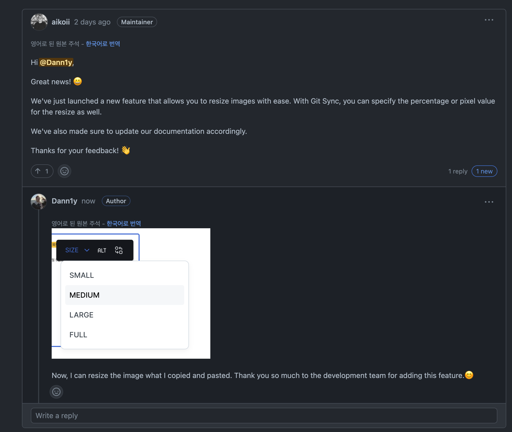
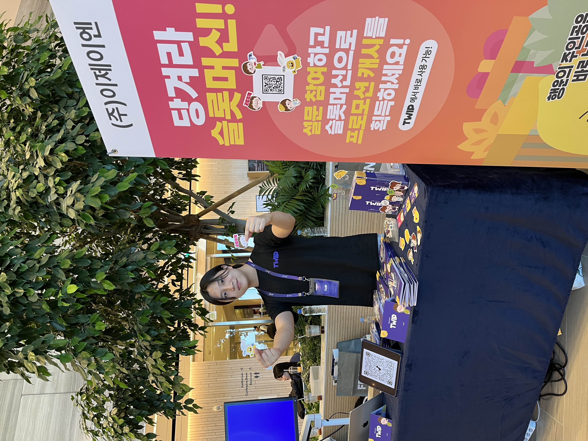

# 2023.10. 어느새 3년차가 되었다.

* FEConf 2023 부스 운영
* 뽑기 후원 런칭
* 3년차

***

## FEConf 2023 부스 운영

[FEConf 2023](https://2023.feconf.kr/)

<figure><figcaption></figcaption></figure>

운이 좋게도 이번에 TWIP이 FEConf 루키에 선정되어 FEConf에 참여할 수 있게 되었다.\
학생 때 부터 쭉 봐온 컨퍼런스고 여기서 얻은 정보로 실제 개발할 때 실천했던 것들도 있어서 감회가 새로웠다.

<figure><figcaption></figcaption></figure>

부스 운영 하느라 스폰서 세션 1개밖에 못 들었는데 새로운 분들도 만나면서 회사 홍보도 하고, 부스를 운영하는 다른 회사분들도 만나서 여러 대화를 나눌 수 있는 좋은 기회였다. 새로운 기능을 개발하느라 팀원 분들이 부스 준비하는데 도움을 많이 주셔서 너무 감사하다.

## 뽑기 후원 런칭

<figure><figcaption></figcaption></figure>

지금까지는 레거시를 2.0버전으로 업그레이드하는 프로젝트만 해왔고 내가 새로운 기능을 개발하는 것은 이번이 처음이다. 옛날 문방구에 있던 뽑기와 비슷한 원리로 내가 번호를 선택해서 후원을 하면 크리에이터의 오버레이에 당첨/꽝 여부가 나오는 방식이다.

후원페이지, 대시보드, 오버레이까지 Frontend 파트를 혼자 담당했는데 개발, 디자인, 소켓 통신, 릴리즈 이후 후속 조치 등 여러 분야에서 어려운 문제들을 풀었던 것 같다. 회고에 풀려고 했으나 내용이 생각보다 길어져 뽑기를 개발하면서 발생한 문제점과 해결 경험에 대한 구체적인 내용은 글을 따로 작성하려고 한다.

**좋았던 점**

* 릴리즈가 문제 없이 진행되었다.
* 릴리즈 이후
  * 여러 크리에이터분들이 컨텐츠로 사용해주셔서 좋았고, 시청자분들도 재밌어하셨던 것 같아서 반응이 재밌었다.
  * 피드백을 리스트업했고, 대부분의 내용을 수정하거나 개선하여 반영했다.
  * 자잘한 개선 사항은 있지만 큰 버그가 터지지 않아서 다행이다.

**개선해야할 점**

* 아직 릴리즈 초창기이고 이제 시작이기 때문에 계속 개선하고 재미를 느낄 수 있는 요소들을 추가하여 더 많은 분들이 사용하실 수 있도록 해야겠다.

## 3년차가 되었다.

고등학생 때 쭉 뚫려있는 빌딩 숲 사이 테헤란로를 보고 가슴 설레었던 나는 21년 9월 테헤란로에서 Frontend 개발자로 커리어를 시작하게 되었고, 쌀쌀해진 날씨인 요즘은 그 때의 찬 공기 향이 떠올라 첫 시작을 떠올리게 된다.

경험은 부족하지만 일을 잘하고 싶다는 열정을 가진 그 때는 정말 많이 부족했다. 2년이 지난 지금도 아직 갈 길이 멀지만 개발, 커뮤니케이션, 일정 관리, 위기 대처, 문제 해결 능력 다방면에서 그 때 보다 성장했다는 피드백을 받으면 감사하기도 하고 여전히 배울 점이 많다고 느낀다.

어려움을 겪거나 벽을 느낄 때가 있으면 다른 개발자분들은 어떻게 문제를 풀어나갔는지 여러 이야기를 듣기도 했고, 운이 좋게 좋은 멘토분을 만나서 대화할 때마다 큰 깨달음을 얻고 본받게 된다.

1년차에는 개발 실력 올리느라 정신이 없었고, 2년차에는 개발 + 커뮤니케이션, 문제 해결, 위기 대처를 많이 배운 것 같다. 다른 실력있고 경험있는 분들이 보기엔 민망할 정도의 수준이지만 과거의 나에 비해서 성장했다는 것만큼은 사실인 것 같다.

프로젝트 2개를 마무리하니 벌써 올해가 2개월 밖에 남지 않았는데 남은 2개월 동안에는 간단한 사이드 프로젝트 하나를 진행해보고 회사 팀 프로젝트를 고도화 하려고 한다.

이번 겨울은 굉장히 추울 것 같은데 결국 오게 될 봄을 대비하며 10월 회고록을 마친다.

글을 읽어주셔서 감사합니다.
